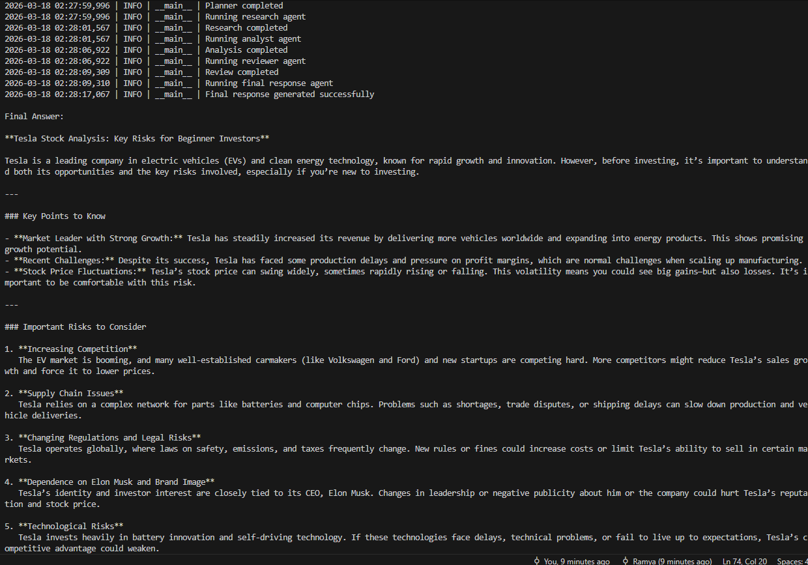

# Multi-Agent AI Task Automation System

A multi-agent system that breaks down complex tasks into structured steps and executes them using specialized AI agents.

## Overview

This project demonstrates how multiple AI agents can collaborate to solve a task through planning, research, analysis, review, and final response generation.

Each agent is responsible for a specific role, enabling more structured and reliable outputs compared to single-prompt systems.

---

## Tech Stack

- Python
- AutoGen (AgentChat)
- OpenAI API
- yfinance (external API integration)

---

## How It Works

1. Planner Agent creates a step-by-step plan  
2. Research Agent gathers information (uses external APIs when needed)  
3. Analyst Agent interprets the research  
4. Reviewer Agent checks for clarity, gaps, and issues  
5. Final Response Agent produces a clean user-facing answer  

---

## Project Structure
# Multi-Agent AI Task Automation System

A multi-agent system that breaks down complex tasks into structured steps and executes them using specialized AI agents.

## Overview

This project demonstrates how multiple AI agents can collaborate to solve a task through planning, research, analysis, review, and final response generation.

Each agent is responsible for a specific role, enabling more structured and reliable outputs compared to single-prompt systems.

---

## Tech Stack

- Python
- AutoGen (AgentChat)
- OpenAI API
- yfinance (external API integration)
- FastAPI

---

## How It Works

1. User submits a task 
2. Planner Agent creates a step-by-step plan  
3. Research Agent gathers information (uses external APIs when needed)  
4. Analyst Agent interprets the research  
5. Reviewer Agent checks for clarity, gaps, and issues  
6. Final Response Agent produces a clean user-facing answer  

## Demo

Example run of the multi-agent system:

## Architecture

Planner → Research (Tool) → Analyst → Reviewer → Final Response
---

## Project Structure

- app/
  - agents.py
  - config.py
  - logging_config.py
  - main.py
  - model_client.py
  - orchestrator_runner.py
  - planner_runner.py
  - schemas.py
  - tools/
    - stock_tool.py

---

## Key Features

- Multi-agent orchestration with role-based agents
- Task decomposition through a planner agent
- External API integration with yfinance
- Tool-enabled research workflow
- Review stage for output quality checks
- Structured logging across orchestration stages
- Output cleanup for demo-friendly responses
- FastAPI endpoint for task execution

---

## Example Flow

Input:
Analyze Tesla stock and summarize key risks for a beginner investor

System Flow:
- Planner → creates steps  
- Research → fetches real data  
- Analyst → generates insights  
- Reviewer → validates output  
- Final agent → produces answer  

Output:
- Clean, structured, beginner-friendly response

---
## API Endpoints 
1. Health Check:
    GET /health
2. Run Task: 
    POST /run-task
3. Example request: 
{
  "task": "Analyze Tesla stock and summarize key risks for a beginner investor.",
  "context": "Keep the explanation simple and suitable for someone new to investing."
}
4. Example response:
{
  "task": "Analyze Tesla stock and summarize key risks for a beginner investor.",
  "plan_steps": [
    "Gather recent Tesla stock performance data and news updates.",
    "Research Tesla's financial health, including revenue, profit, and debt levels.",
    "Identify industry and market risks affecting Tesla, such as competition and regulation.",
    "Note company-specific risks like production challenges and leadership decisions.",
    "Summarize the key risks in clear, beginner-friendly terms."
  ],
  "research_output": "...",
  "analysis_output": "...",
  "review_output": "...",
  "final_answer": "..."
}

## How to Run

1. Create virtual environment:
python -m venv venv
venv\Scripts\activate

2. Install dependencies:
pip install -r requirements.txt

3. Add environment variables:
Create .env:
OPENAI_API_KEY=your_key_here
MODEL_NAME=gpt-4.1-mini
LOG_LEVEL=INFO

4. Run the local orchestrator:
python -m app.orchestrator_runner

5. Run the FastAPI service
uvicorn app.main:app --reload

Open Swagger UI:
http://127.0.0.1:8000/docs

## What This Project Demonstrates
- multi-agent system design
- agent orchestration across specialized roles
- tool-augmented AI workflows
- external API integration
- output review and quality control
- production-minded logging and API exposure

## Future Improvements
- add support for more external tools
- add task memory across runs
- add evaluation metrics for agent output quality
- add caching for repeated tool calls
- add deployment with Docker
